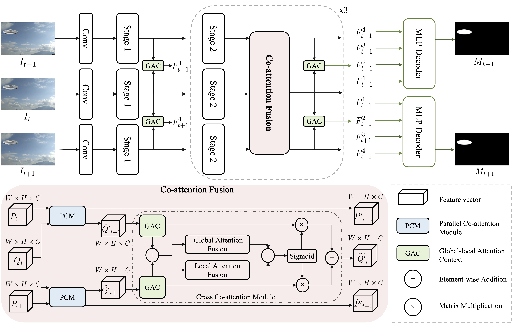

## Spatio-Temporal Co-Attention Fusion Network for Video Splicing Localization
An official implementation code for paper "[Spatio-Temporal Co-Attention Fusion Network for Video Splicing Localization](https://caps.luminad.com:8443/stockage/stock/SPIE/LDL-SPIE-JEI-240106G/JEI-240106G_online.pdf)", JEI 2024.
This repo will provide <B>codes, trained weights, and our training datasets</B>. 

## Network Architecture
<center>  </center>

 
## Training
- Prepare for the training datasets.
```
└─dataset
   ├── train
   │     ├── videos
   │     │   ├── video_00000
   │     │   │    ├── 00000.png
   │     │   │    └── ...
   │     │   └── ...
   │     └── masks
   │         ├── video_00000
   │         │    ├── 00000.png
   │         │    └── ...
   │         └── ...
   └── val
         ├── videos
         │   ├── video_00000
         │   │    ├── 00000.png
         │   │    └── ...
         │   └── ...
         └── masks
             ├── video_00000
             │    ├── 00000.png
             │    └── ...
             └── ...
```
- Modify configuration in `libs/utils/config_standard_db.py`.

```
python train.py
```

## Testing
Download the weights from [Google Drive Link](https://drive.google.com/drive/folders/18XDRMBa71FZNiPeRxs09ZTVJj6E03ZuR?usp=sharing) and move it into the `checkpoints/`.

- Run on a dataset.
```
python test.py
```

- Run on a video.
```
python demo.py
```


## License 
The code and dataset is released only for academic research. 
Commercial usage is strictly prohibited.

## Citation
 ```
@article{Lin2024SCFNet,
author = {Man Lin and Gang Cao and Zijie Lou and Chi Zhang},
title = {{Spatio-temporal co-attention fusion network for video splicing localization}},
volume = {33},
journal = {Journal of Electronic Imaging},
number = {3},
publisher = {SPIE},
pages = {033027},
year = {2024},
doi = {10.1117/1.JEI.33.3.033027},
URL = {https://doi.org/10.1117/1.JEI.33.3.033027}
}
```

## Contact
If you have any questions, please contact me(lyan924@cuc.edu.cn).

